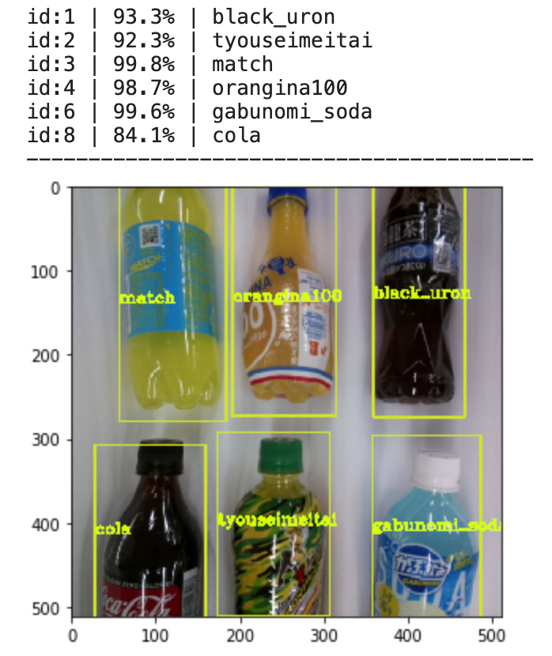

# Self-Checkout
- 「Raspberry Pi 3」で動くペットボトルを銘柄単位で検出するセルフレジ。
- 精度100%。
- 撮影から、画像認識、推論までを3秒以内で実行し複数同時検出が可能。  
- [企画書](https://github.com/tkyiw/SelfCheckout/blob/master/%E3%82%BB%E3%83%AB%E3%83%95%E3%83%AC%E3%82%B8%E3%81%AE%E3%83%97%E3%83%AD%E3%83%88%E3%82%BF%E3%82%A4%E3%83%97%E3%81%AE%E3%81%94%E6%8F%90%E6%A1%88.pdf)

### 動作環境
Raspberry Pi3 Model B  
Python: 3.7.6  
Tensorflow: 1.14.0  
OpenCV: 4.2.0  
### 物体検出例

